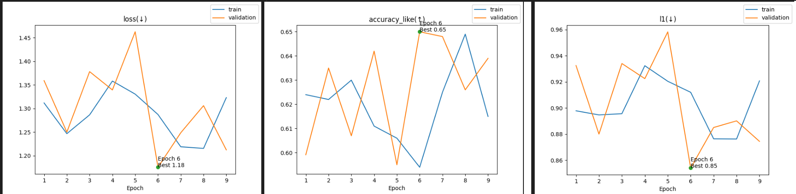
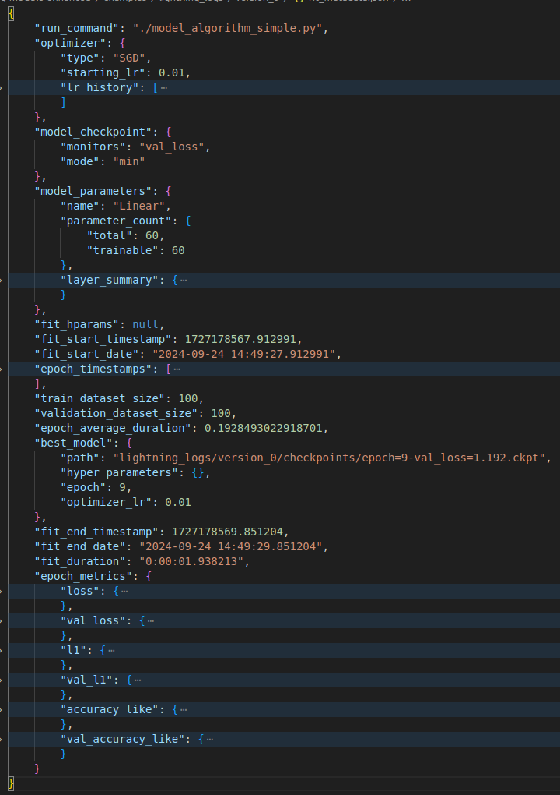

# Model algorithm

We may want some low level control over the model algorithm, that is more complicated than a feed forward network.
We support this via a callback. The default is `LME.feed_forward_algorithm` as explained earlier. See `test_fit.py`
for more examples.

See runnable example: [copy pasta from here](../examples/model_algorithm_simple.py).

```python
#!/usr/bin/env python3
"""simple usage of model_algorithm callback"""
from __future__ import annotations
from pytorch_lightning import Trainer
from pytorch_lightning.loggers import CSVLogger
import torch as tr
from lightning_module_enhanced import LME
from lightning_module_enhanced.callbacks import PlotMetrics

class MyReader:
    def __init__(self, n: int, in_c: int, out_c: int):
        self.in_c = in_c
        self.out_c = out_c
        self.n = n

    def __len__(self):
        return self.n

    def __getitem__(self, ix):
        return tr.randn(self.in_c), tr.randn(self.out_c)

def my_model_algo(model: LME, batch: dict) -> tuple[tr.Tensor, dict[str, tr.Tensor]]:
    x, gt = batch
    y = model.forward(x)
    res = model.lme_metrics(y, gt, include_loss=False) # if set to True, remove next line
    res["loss"] = model.criterion_fn(y, gt)
    return y, res, x, gt

if __name__ == "__main__":
    in_c, out_c = 5, 10
    model = LME(tr.nn.Linear(in_c, out_c))
    model.criterion_fn = lambda y, gt: (y - gt).pow(2).mean()
    model.optimizer = tr.optim.SGD(model.parameters(), lr=0.01)
    model.metrics = {
        "l1": (lambda y, gt: (y - gt).abs().mean(), "min"),
        "accuracy_like": (lambda y, gt: ((y > 0.5) == (gt > 0.5)).type(tr.float32).mean(), "max")
    }
    model.model_algorithm = my_model_algo
    model.callbacks = [PlotMetrics()]
    train_loader = tr.utils.data.DataLoader(MyReader(n=100, in_c=in_c, out_c=out_c), batch_size=10)
    val_loader = tr.utils.data.DataLoader(MyReader(n=100, in_c=in_c, out_c=out_c), batch_size=10)
    Trainer(max_epochs=10, logger=CSVLogger("")).fit(model, train_loader, val_dataloaders=val_loader)
```

In `lightning_logs/version_x` you should find this after you run:
```bash
[user]$ python model_algorithm_simple.py
[user]$ ls lightning_logs/version_0/
accuracy_like.png  checkpoints  fit_metadata.json  hparams.yaml  l1.png  loss.png  metrics.csv
```

The plots were generated using the `PlotMetrics()` callback that interacts with the `CSVLogger` and the `model.metrics`
setter.



Furthermore, it produces a `fit_metadata.json` file that is a JSON object with information related to the training
process, such as learning rate history, metrics for each epoch (Any sort of tensor not just what's possible in
`self.log(...)`) and other information:


